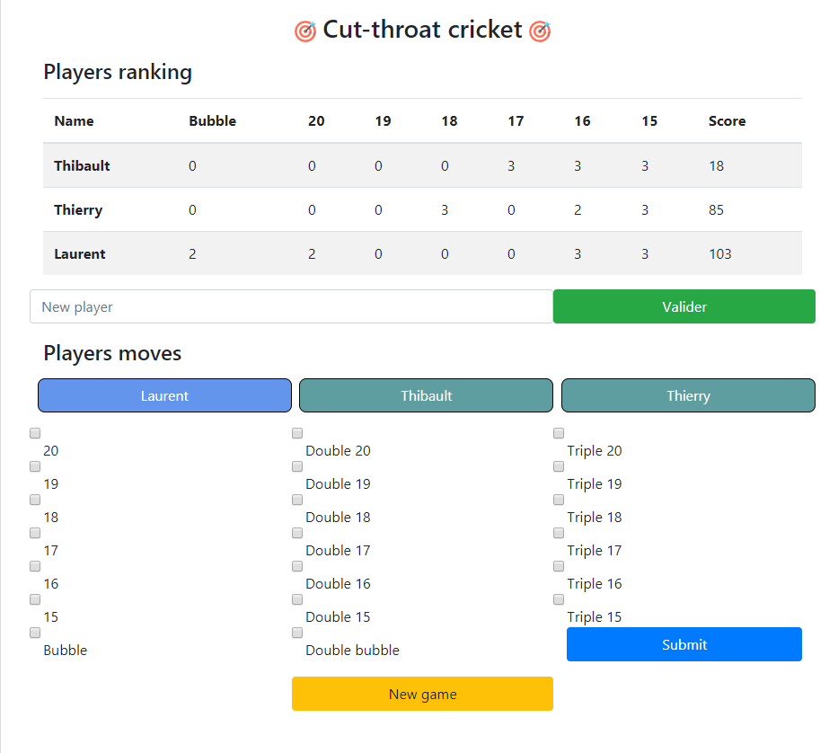

# Cut-throat criket (Darts game)

This project was develop in order to answer a need of my friend and I.
In fact, we bought a darts game and we played this game **cut-throat criket**, whom rules are given below. But we had to count our points and right it down, which was something not practical. This is why I developed this web application, _*to store and automatically calculate people's scores.*_

## Rules of the game

- every player wait his turn and throw 3 darts. The targets are the segments 15 to 20 and the bullseye.
- when one of the targeted segment is reached 3 times (the double ring counts for 2 and the triple ring for 3), the segment is closed
- when a player has closed a segment and reachs it again, every players who didn't close the segment take points (e.g. 50 points for the inner bullseye or 51 for a triple 17)

The **goal** of this game is to be the first who closes all the segments and has less points than the other.

## Deployment

The application is deployed with GitHub at the following address
[julien-verdun.github.io](https://julien-verdun.github.io/).

### Overview of the application

